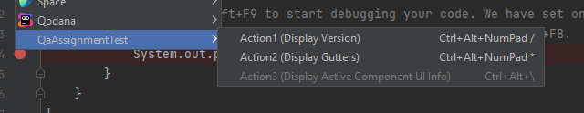

# QA Automation IDE Services test assignment
## Objective
Create a custom plugin for IntelliJ IDEA version 2024.3 using Kotlin
## Tasks
1. Implement the following three actions, ensuring that they are accessible from the `Tools` dropdown menu.
   1. Action 1: Display the installed version of the Kotlin plugin.
   2. Action 2: Display all Gutter Icons present in the currently opened file.
   3. Action 3: Display information about the currently selected UI Component.
2. Provide a concise checklist or test scenario to validate your plugin's functionality.
## Additional Suggestion
Due to PC slowness, hotkeys have been added to each plugin action. 
UI tests mostly use hotkeys to open related plugin action dialogs. 
However, three UI tests utilize the Tools menu to open action dialogs to ensure that plugin dialogs are accessible from the Tools menu.

All three dialogs have been added to the Tools menu as the last items under the submenu "QaAssignmentTest":

## Test Launching
Due to PC slowness, I'm unable to run and test in one command. That is why I suggest first starting the local IDE server with:
`./gradlew clean runIdeForUiTests &`

From the project root folder, and after the IDE Welcome Screen appears, run the following command in a separate terminal from the project root folder:
`./gradlew test`
and one more time activate Intellij IDE Welcome Screen

# Test Scenarios
## Action 1 (Display Kotlin plugin version)
1. Kotlin plugin installed
   1. On the IDE Welcome Screen (only hotkeys can be used).
   2. When the project is open (both hotkeys and the Tools → QaAssignmentTest menu).
2. Kotlin plugin NOT installed (MANUAL verification, no automated UI test):
   1. On the IDE Welcome Screen (only hotkeys can be used).
   2. When the project is open (both hotkeys and the Tools → QaAssignmentTest menu).
## Action 2 (Display list of Gutters)
1. On the Welcome Screen (only hotkeys can be used).
   1. Observe that dialog contains a message: "There are no active project"
2. When the project is open (both hotkeys and the Tools menu can be used):
   1. Observe that if the file contains gutters, they are all displayed in the dialog.
   2. Add 2–3 gutters on the same line (for example, "run", "breakpoint", and "bookmark" gutters) and observe that they are displayed in the dialog.
   3. Remove one of the gutters (e.g., the gutter in the middle) and observe that all other gutters remain in the dialog.
   4. Open a file without gutters and observe that the dialog contains a message like: "File: $FullPath/FileName$ has no gutters."
   5. Close all files and observe that the dialog contains a message: "There are no open project files."
## Action3 (Display Active Component UI Info)
**Disclaimer:**

This action works only when a project is open.

It does not work with any menu items, popups, or similar elements.

In real plugin testing, it would be necessary to verify all possible types of UI components.
Here, I verify only some UI components in the ProjectTreeView and the File Editor.
1. Editor UI Component Info (open any source code file):
   1. Place the cursor on any function name and observe that the dialog contains information like: "PsiMethod:$Method Name$".
   2. Place the cursor on any variable name and observe that the dialog contains information like: "PsiLocalVariable:$Variable Name$". 
   3. Place the cursor on a non-UI component line (for example, on "}") and observe that the dialog displays the message: "No selected UI Component".
2. Project Tree View:
   1. Select any folder in the project tree view and observe that the dialog contains information like: "PsiDirectory:$FullPath$".
   2. Select a class file in the project tree view and observe that the dialog contains: "PsiClass:$ClassName$".